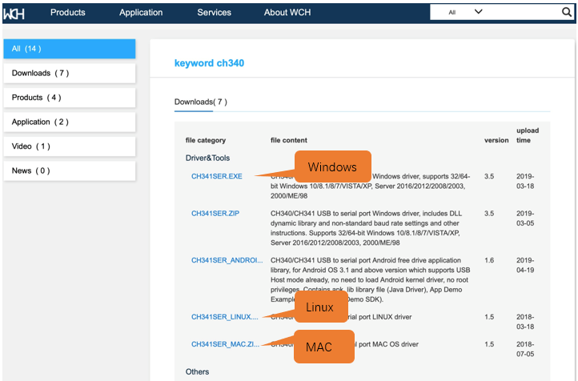
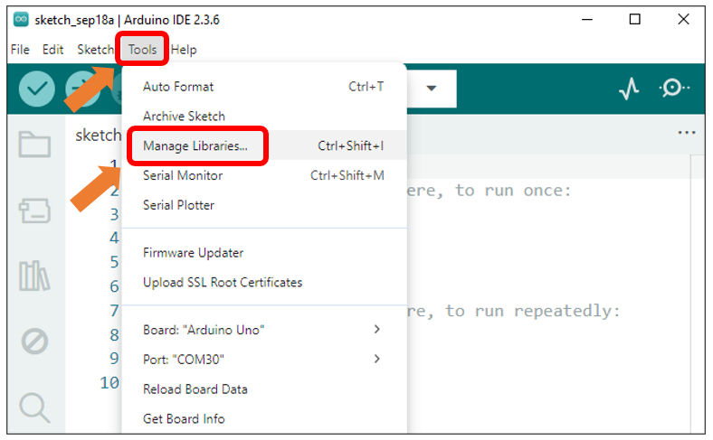
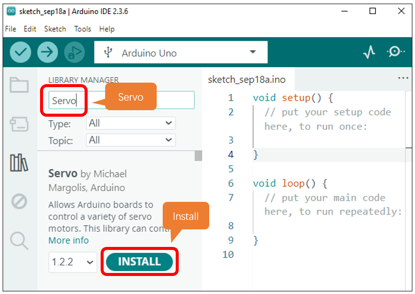
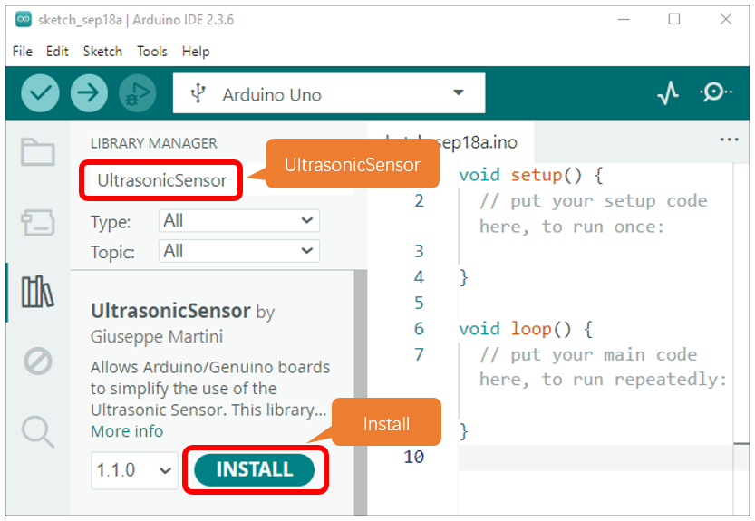
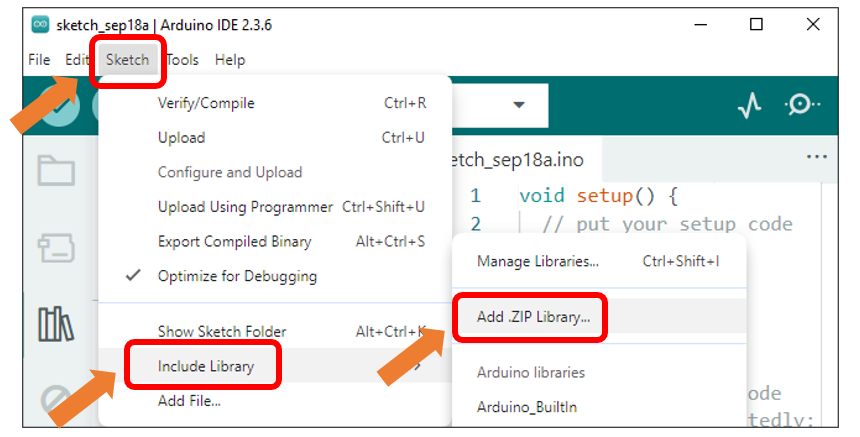
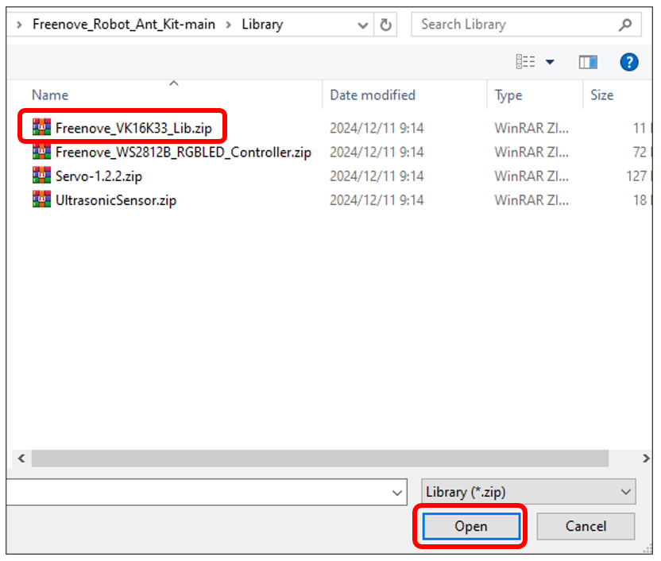
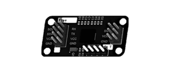
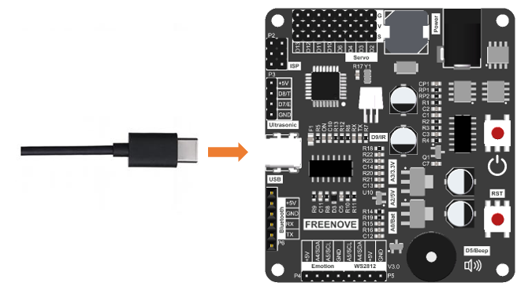

##############################################################################
Chapter 0 Software Installation and Assembly 
##############################################################################

If you haven't downloaded the sources for the robot ant, you can download them via the link below: https://github.com/Freenove/Freenove_Robot_Ant_Kit

01 Installation of CH340
**********************************************

We upload code to the control board through CH340. Therefore, we need to install the driver for CH340 first. 

Windows
=============================================

Check whether CH340 has been installed to your computer.

1.	Connect the control board with a Type-C cable.

2.	Back to the computer homepage, right-click on “This PC” and select “Manage”.

3.	Click “Device Manage” on the pop-up window. If CH340 has been installed to your computer, you can see “USB-SERIAL CH340 (COMx)”. 

.. note:: Only when the control board has connected with computer will “USB-SERIAL CH340 (COMx)” show up.

If you have installed CH340, you can skip to next step. 

If you haven't, please install it as follows. 

Install CH340 Driver 
-----------------------------------------

1.	Click http://www.wch-ic.com/search?q=CH340&t=downloads to go to the downloading website of CH340. Choose a proper CH340 driver based on your operating system.

If you don't feel like downloading CH340 driver from the official website, you can also open the folder “Freenove_Robot_Ant_Kit/CH340”. We've prepared it for you in advance. 

2.	Open the folder “Freenove_Robot_Ant_Kit/CH340/Windows/”. 

3.	Double click to open “CH341SER.EXE”.

4.	Click “INSTALL” and wait for the installation to finish. 

5.	When the following interface appears, it means the installation is successful. You can close it. 

.. image:: ../_static/imgs/0_Software_Installation_and_Assembly_/Chapter00_07.png
    :align: center

6.	Connect the control board and computer with a type-C cable, when clicking “Device Manager” again, you will see “USB-SERIAL CH340 (COMx)” under “Ports (COM & LPT)”. Click here to skip to next step. 

7.	So far, CH340 has been installed. You can close all windows. 

Mac
==============================================

1.	Click http://www.wch-ic.com/search?q=CH340&t=downloads to go to the downloading website of CH340. Choose a proper CH340 driver based on your operating system.

If you don't feel like downloading CH340 driver from the official website, you can also open the folder “Freenove_Robot_Ant_Kit/CH340”. We've prepared it for you in advance. 

2.	Open “Freenove_Ant_Kit/CH340/MAC/”.

3.	Click on Continue.

4.	Click on Install.

5.	Wait for the installation to finish. 

6.	Restart your computer.

If you fail to install CH340 follwing the steps above, please refer to ReadMe.pdf.

02 Installation of Arduino IDE
*********************************************

Arduino Software (IDE) is used to write and upload the code for Arduino Board.

First, install Arduino Software (IDE): visit https://www.arduino.cc/en/software/

.. image:: ../_static/imgs/0_Software_Installation_and_Assembly_/Preface03.png
    :align: center

Select and download corresponding installer based on your operating system. If you are a Windows user, please select the "Windows" to download and install the driver correctly.

.. image:: ../_static/imgs/0_Software_Installation_and_Assembly_/Preface04.png
    :align: center

After the downloading completes, run the installer. For Windows users, there may pop up an installation dialog box of driver during the installation process. When it is popped up, please allow the installation.

After installation is completed, an shortcut will be generated in the desktop.

.. image:: ../_static/imgs/0_Software_Installation_and_Assembly_/Preface05.png
    :align: center

Run it. The interface of the software is as follows:

.. image:: ../_static/imgs/0_Software_Installation_and_Assembly_/Preface06.png
    :align: center

Programs written with Arduino IDE are called sketches. These sketches are written in a text editor and are saved with the file extension.ino. The editor has features for cutting/pasting and for searching/replacing text. The console displays text output by the Arduino IDE, including complete error messages and other information. The bottom right-hand corner of the window displays the configured board and serial port. The toolbar buttons allow you to verify and upload programs, open the serial monitor, and access the serial plotter.

.. table::
    :align: center
    :class: table-line
    :width: 80%
    
    +-------------+---------------------------------------------------------------------+
    | |Preface07| | Verify                                                              |
    |             |                                                                     |
    |             | Checks your code for errors compiling it.                           |
    +-------------+---------------------------------------------------------------------+
    | |Preface08| | Upload                                                              |
    |             |                                                                     |
    |             | Compiles your code and uploads it to the configured board.          |
    +-------------+---------------------------------------------------------------------+
    | |Preface09| | Debug                                                               |
    |             |                                                                     |
    |             | Troubleshoot code errors and monitor program running status.        |
    +-------------+---------------------------------------------------------------------+
    | |Preface10| | Serial Plotter                                                      |
    |             |                                                                     |
    |             | Real-time plotting of serial port data charts.                      |
    +-------------+---------------------------------------------------------------------+
    | |Preface11| | Serial Monitor                                                      |
    |             |                                                                     |
    |             | Used for debugging and communication between devices and computers. |
    +-------------+---------------------------------------------------------------------+

.. |Preface07| image:: ../_static/imgs/0_Software_Installation_and_Assembly_/Preface07.png
.. |Preface08| image:: ../_static/imgs/0_Software_Installation_and_Assembly_/Preface08.png
.. |Preface09| image:: ../_static/imgs/0_Software_Installation_and_Assembly_/Preface09.png

.. |Preface11| image:: ../_static/imgs/0_Software_Installation_and_Assembly_/Preface11.png

03 Installation of Libraries
***************************************

In this tutorial, we use serveral libraries: Servo, UltrasonicSensor, Freenove_VK16K33_Lib and Freenove_WS2812_RGBLED_Controller respectively. Before running the sketches we provide, please make sure all the libraries have been installed. Otherewise, they may fail to run. 

1.	Open Arduino IDE, click on Sketch on Menus, select Include Library and then click on Manage Libraries….

2.	On the pop-up window, input **Servo** and press Enter. Select the Servo library as marked below and click to install.

3.	 After Servo library installs successfully, go on to input the name of the next library, that is, **UltrasonicSensor** and then install it.

4.	After finishing installation, install the next library **Freenove_WS3212B_RGBLED_Controller** in the same way. 

There is also another way to install libraries.

5.	Click on Sketch on Menus, select Include Library, and then click on Add .ZIP Libraries….

6.	On the pop-up window, select the source pakage **Freenove_Robot_Ant_Kit/Library/Freenove_VK16K33_Lib.zip** and click on **Open**.

04 Control board
**************************************

1.	DC005: Powered by 2 18650 batteries. Supports 7-12V power supply. 

2.	Power button: Uses digital chip circuits to control the power's ON and OFF. It's more durable than traditional switches. 

3.	Reset button: Reset the control board.

4.	Passive buzzer: Controlled by D5 pin on ArduiNo. 

5.	Servo: Controlled by D2, D3 and D4 on Arduino with D2 connecting to Servo1, D3 connecting to Servo2 and D4 connecting to Servo3. 

6.	ISP connector: Uses ISP to download programmer to download code. 

7.	Ultrasonic connector: If you use ultrasonic module for the ant's head, please connect it to this port. Connect D8 of the Arduino to Trig pin of ultrasonic module and D7 to Echo. 

8.	USB port: Connect computer and control board with a type-C cable to download programs.  

9.	Indicators: Used to indicates whether the board is powered and the status of the serial port. 

10.	Bluetooth connector: Plug the Bluetooth module HC-05 to this port. Note: The Bluetooth module should orient to the control board. 

11.	LED matrix connector: If you use LED matrix for the ant's head, please connect it to this port. 

12.	RGB LED module: the IIC port to connect to RGB LED module. 

The pinout of the control board is as below:

.. table::
    :align: center
    :class: zebra
    
    +------+------------------------+---------------------------------------------------------+
    | Pins |       Functions        |                      Introduction                       |
    +======+========================+=========================================================+
    | 0    | Uart-RX                | Bluetooth module. Please remove it when uploading code. |
    +------+------------------------+                                                         |
    | 1    | Uart-TX                |                                                         |
    +------+------------------------+---------------------------------------------------------+
    | 2    | Servo1                 | Servo motors                                            |
    +------+------------------------+                                                         |
    | 3    | Servo2                 |                                                         |
    +------+------------------------+                                                         |
    | 4    | Servo3                 |                                                         |
    +------+------------------------+---------------------------------------------------------+
    | 5    | Buzzer                 | Buzzer                                                  |
    +------+------------------------+---------------------------------------------------------+
    | 6    |                        | Extension IO                                            |
    +------+------------------------+---------------------------------------------------------+
    | 7    | Ultrasonic-Echo        | Ultrasonic module                                       |
    +------+------------------------+---------------------------------------------------------+
    | 8    | Ultrasonic-Trig        |                                                         |
    +------+------------------------+---------------------------------------------------------+
    | 9    | Infrared receiving pin | Infrared module                                         |
    +------+------------------------+---------------------------------------------------------+
    | 10   |                        | Extension IO                                            |
    +------+------------------------+---------------------------------------------------------+
    | 11   |                        | ISP/Extension IO                                        |
    +------+------------------------+---------------------------------------------------------+
    | 12   |                        | ISP/Extension IO                                        |
    +------+------------------------+---------------------------------------------------------+
    | 13   |                        | ISP/Extension IO                                        |
    +------+------------------------+---------------------------------------------------------+
    | A0   | Battery Voltage Pin    | Detect voltage of batteries(1/4)                        |
    +------+------------------------+---------------------------------------------------------+
    | A1   | AREF Pin               | Detect voltage of AREF pin                              |
    +------+------------------------+---------------------------------------------------------+
    | A2   | 5V Voltage Pin         | Detect 5V voltage(1/4)                                  |
    +------+------------------------+---------------------------------------------------------+
    | A3   | 3.3V Voltage Pin       | Detect 3.3V Voltage(1/4)                                |
    +------+------------------------+---------------------------------------------------------+
    | A4   | IIC-SDA                | WS2812 RGB LED module/LED Matrix (Expression module)    |
    +------+------------------------+                                                         |
    | A5   | IIC-SCL                |                                                         |
    +------+------------------------+---------------------------------------------------------+

05 Component List
***************************************

Before assembly, please compare the list with the kit you receive to make sure that no item is missed or damaged. Should this happens, please send emails to us: support@freenove.com, we will offer solution.

.. table::
    :align: center
    :class: table-line
    :width: 80%
    
    +----------------------------------------------------------------------------------------+
    | Acrylic parts                                                                          |
    |                                                                                        |
    | |Chapter00_27|                                                                         |
    +---------------------------------------------+------------------------------------------+
    | Servo \*3                                   | Expression Module \*1                    |
    |                                             |                                          |
    | |Chapter00_28|                              | |Chapter00_29|                           |
    +---------------------------------------------+------------------------------------------+
    | 8-digit RGB LED Module \*1                  | I2C RGB LED Control Module \*1           |
    |                                             |                                          |
    | |Chapter00_30|                              | |Chapter00_31|                           |
    +---------------------------------------------+------------------------------------------+
    | Ultrasonic Module \*1                       | Bluetooth Module \*1                     |
    |                                             |                                          |
    | |Chapter00_32|                              | |Chapter00_33|                           |
    +---------------------------------------------+------------------------------------------+
    | Infrared Remote Controller \*1              | Battery Holder \*1                       |
    |                                             |                                          |
    | |Chapter00_34|                              | |Chapter00_35|                           |
    +---------------------------------------------+------------------------------------------+
    | Control board \*1                                                                      |
    |                                                                                        |
    | |Chapter00_36|                                                                         |
    +----------------------------------------------------------------------------------------+
    | 4P F-F Jumper Wires 20cm \*3                                                           |
    |                                                                                        |
    | |Chapter00_37|                                                                         |
    +----------------------------------------------------------------------------------------+
    | 3P F-F Jumper Wires 20cm \*1                                                           |
    |                                                                                        |
    | |Chapter00_38|                                                                         |
    +--------------------------------+--------------------------------+----------------------+
    | Tidy Cable 15cm \*1            | Type-C USB Cable \*1           |Metal cross sleeve \*1|
    |                                |                                |                      |
    | |Chapter00_39|                 | |Chapter00_40|                 | |Chapter00_41|       |
    +--------------------------------+--------------------------------+----------------------+
    | Machinery Parts                                                                        |
    |                                                                                        |
    | |Chapter00_42|                                                                         |
    +--------------------------------+--------------------------------+----------------------+
    | Cross Screwdriver (3mm) \*1    | Cross Screwdriver (2mm) \*1    | PVC rubber sheath \*8|
    |                                |                                |                      |
    | |Chapter00_43|                 | |Chapter00_44|                 | |Chapter00_45|       |
    +--------------------------------+--------------------------------+----------------------+
    | Required but NOT Contained Parts                                                       |
    |                                                                                        |
    | 2 x 3.7V 18650 lithium rechargeable batteries with continuous discharge current >3A.   |
    |                                                                                        |
    | Please refer to AboutBattery.pdf to purchase the batteries.                            |
    |                                                                                        |
    | |Chapter00_46|                                                                         |
    +----------------------------------------------------------------------------------------+

06 Assembly
******************************************

Set Servo Gear to 90°
==========================================

**Before installing the legs, please set the servos to 90°. Only after doing this can you assemble the robot ant correctly.**

Step 1: Connect the control board and computer with a type-C cable.

Step 2: Open the file 00.Servo_90.ino in Freenove_Robot_Ant_Kit\\Sketches\\00.Servo_90.

Step 3: Click on Tools and then select “Arduino Uno” for Board and port COMx for port. In our computer, the port is COM3.

Note: 

1.	Generally, COM1 is not the port of development board, so please do NOT choose it. 

2.	The x of COMx varifies among different computers. If you cannot find your port, please check whether CH340 has been installed or whether the board has connected to PC.

Step 4: Click to download Code (Upload Using Programmer).

Step 5. Plug the power cord from the battery holder into control board.

Step 6. Connect 3 servos to the control board and press the power button. 

Step 7: When you see the power indicator on the board light up, and all the 3 servos rotate to a specific position and remain still, it means you have set the servos to the middle position. At this point, you can assemble the legs. 

If the servos have been at that position, you won't observe anything.

Assembly of Legs
==========================================

.. table::
    :align: center
    :class: table-line
    :width: 80%
    
    +---------------------------------------------------------------------------------------------------+
    | Use 4 M4*14 screws and 4 M4 nuts to fix a servo to No.6 acylic part.                              |
    |                                                                                                   |
    | |Chapter00_52|                                                                                    |
    +---------------------------------------------------------------------------------------------------+
    | Fix 3 servos to No.1 acrylic part. (8 M4*14 screws, 8 M4 nuts, 2 M3*12 screws and 2 M3 nuts)      |
    |                                                                                                   |
    | |Chapter00_53|                                                                                    |
    |                                                                                                   |
    | On the left is the plan view of the acrylic part.                                                 |
    |                                                                                                   |
    | On the right is its perspective view.                                                             |
    +---------------------------------------------------------------------------------------------------+
    | Use 4 tappping screws to fix the disc servo arms to two No.4 acrylic parts.                       |
    |                                                                                                   |
    | Note: Tapping screws, disc servo arms and servos are packed in the servo package,                 |
    |                                                                                                   |
    | please don't use wrong ones.                                                                      |
    |                                                                                                   |
    | It is a bit strenuous to make the disc servo arm fix tightly, which is normal.                    |
    |                                                                                                   |
    | |Chapter00_54|                                                                                    |
    +---------------------------------------------------------------------------------------------------+
    | Use 2 tapping screws to fix the disc servo arms to No.3 acrylic part.                             |
    |                                                                                                   |
    | Note: Tapping screws, disc servo arms and servos are packed in the servo package,                 |
    |                                                                                                   |
    | please don't use wrong ones.                                                                      |
    |                                                                                                   |
    | It is a bit strenuous to make the disc servo arm fix tightly, which is normal.                    |
    |                                                                                                   |
    | |Chapter00_55|                                                                                    |
    +---------------------------------------------------------------------------------------------------+
    | Use 4 M3*12 screws and 4 M3 nuts to fix 4 No.5 acrylic parts to 2 No.4 acrylic parts.             |
    |                                                                                                   |
    | |Chapter00_56|                                                                                    |
    +---------------------------------------------------------------------------------------------------+
    | Use 3 servo arm screw to fix 3 servos to No.3 acrylic part and 2 No.4 acrylic parts respectively. |
    |                                                                                                   |
    | Note: servo arm screws are packed with the servos. Don't use wrong ones.                          |
    |                                                                                                   |
    | |Chapter00_57|                                                                                    |
    +---------------------------------------------------------------------------------------------------+
    | When finish assembly, from the top view, it looks as below:                                       |
    |                                                                                                   |
    | |Chapter00_58|                                                                                    |
    +---------------------------------------------------------------------------------------------------+

Assembly of Battery Holder
=======================================

.. table::
    :align: center
    :class: table-line
    :width: 80%
    
    +----------------------------------------------------------------------------------------------------+
    | Use 4 M3*10 screws and 4 M3 nuts to fix the 18650 battery holder to the back of No.1 acrylic part. |
    |                                                                                                    |
    | |Chapter00_59|                                                                                     |
    |                                                                                                    |
    | The left is the bottom view and the right is the top view                                          |
    +----------------------------------------------------------------------------------------------------+

Assemby of the Control board
======================================

.. table::
    :align: center
    :class: table-line
    :width: 80%
    
    +-----------------------------------------------------------------------------------+
    | Use 4 M3*8 screws to fix 4 M3*10 brass standoffs to No.1 acrylic part. (Top view) |
    |                                                                                   |
    | |Chapter00_60|                                                                    |
    +-----------------------------------------------------------------------------------+
    | Use 4 M3*8 screws to fix the control board to the brass standoffs.                |
    |                                                                                   |
    | |Chapter00_61|                                                                    |
    +-----------------------------------------------------------------------------------+
    | Pay attention to the orientation of the control board. (Top view)                 |
    |                                                                                   |
    | |Chapter00_62|                                                                    |
    +-----------------------------------------------------------------------------------+

Assembly of the WS2812 LED Module
======================================

.. table::
    :align: center
    :class: table-line
    :width: 80%
    
    +------------------------------------------------------------------------------------------------------+
    | Use 8 M3*10 screws and 8 M3 nuts to fix the LED module and LED control module to No.2 acrylic parts. |
    |                                                                                                      |
    | |Chapter00_63|                                                                                       |
    |                                                                                                      |
    | Bottom view:                                                                                         |
    |                                                                                                      |
    | |Chapter00_64|                                                                                       |
    |                                                                                                      |
    | Top view:                                                                                            |
    |                                                                                                      |
    | |Chapter00_65|                                                                                       |
    |                                                                                                      |
    | Perspective:                                                                                         |
    +------------------------------------------------------------------------------------------------------+
    | Wirng of RGB LED module to its control module                                                        |
    |                                                                                                      |
    | |Chapter00_66|                                                                                       |
    +------------------------------------------------------------------------------------------------------+

Assembly of the Body
====================================

.. table::
    :align: center
    :class: table-line
    :width: 80%
    
    +----------------------------------------------------------------------------------+
    | Use 4 M3*8 screws to fix 4 M3*40 brass standoff to No.1 acrylic part. (Top view) |
    |                                                                                  |
    | |Chapter00_67|                                                                   |
    +----------------------------------------------------------------------------------+
    | Use 4 M3*8 screws to fix No.2 acrylic part to the standoffs. (Top view)          |
    |                                                                                  |
    | Pay attention to the orientation of No.2 acrylic parts.                          |
    |                                                                                  |
    | |Chapter00_68|                                                                   |
    +----------------------------------------------------------------------------------+
    | Wirng of the LED control module to control board                                 |
    |                                                                                  |
    | |Chapter00_69|                                                                   |
    +----------------------------------------------------------------------------------+

Assembly of the Head
====================================

.. table::
    :align: center
    :class: table-line
    :width: 80%
    
    +---------------------------------------------------------------------------------------+
    | Use 4 M1.4*5 tapping screws to fix the ultrasonic module to No.7 acylic part.         |
    |                                                                                       |
    | |Chapter00_70|                                                                        |
    +---------------------------------------------------------------------------------------+
    | Use 4 M1.4*5 tapping screws to fix the expression module to No.8 acrylic part.        |
    |                                                                                       |
    | |Chapter00_71|                                                                        |
    +---------------------------------------------------------------------------------------+
    | Use a M3*12 screw and a M3 nut to fix No.7 or No.8 acrylic part to No.1 acrylic part. |
    |                                                                                       |
    | |Chapter00_72|                                                                        |
    +---------------------------------------------------------------------------------------+
    | Wiring of ultrasonic module to control board                                          |
    |                                                                                       |
    | |Chapter00_73|                                                                        |
    +---------------------------------------------------------------------------------------+
    | Wiring of the expression module to control board.                                     |
    |                                                                                       |
    | |Chapter00_74|                                                                        |
    +---------------------------------------------------------------------------------------+

.. |Chapter00_72| image:: ../_static/imgs/0_Software_Installation_and_Assembly_/Chapter00_72.png

07 Test
1, Connect the control board and computer with a type-C cable.

2, Open 10.Multifunctional_Ant.ino in Freenove_Robot_Ant_Kit\\Sketches\\10.Multifunctional_Ant. Click to download the code to control board.

3, When the code is downloaded successfully, you can unplug the cable. 

.. note::
    
    **Remember to remove Bluetooth module every time when you upload code; Otherwise the uploading will fail.**

4, Plug in the Bluetooth module. **Please pay attention to the orientation of the Bluetooth module.**

5, Turn ON the power. When you hear a beep from buzzer, it means that the robot ant is ready. You can control it through the phone APP. 

App download address: https://github.com/Freenove/Freenove_app_for_Android

You can also control the robot with Infrared remote controller.

