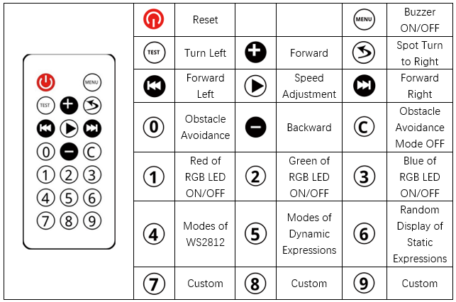

##############################################################################
Chapter 10 Integrated Routine
##############################################################################

In this chapter, we will integrate all the previous features to make a robot feature with RGB LED, expressions, buzzer, battery level query and modes of infrared remote control, Bluetooth remote control, and obstacle avoidance.

Sketch
**********************************

Open 10.Multifunctional_Ant.ino in Freenove_Robot_Ant_Kit\\Sketches\\10.Multifunctional_Ant.

Before uploading code, please remove the Bluetooth module. After compile and upload code to control board, replug in the Bluetooth module and then turn ON power.

You can also use phone APP to control the robot ant.

Code
=================================

.. literalinclude:: ../../../freenove_Kit/Sketches/10.Multifunctional_Ant/10.Multifunctional_Ant.ino
    :linenos: 
    :language: c
    :dedent:

Explanation of Code
=================================

Include the header file of library function, which makes it easier to call the program.

.. literalinclude:: ../../../freenove_Kit/Sketches/10.Multifunctional_Ant/10.Multifunctional_Ant.ino
    :linenos: 
    :language: c
    :lines: 7-13
    :dedent:

The initialization function of each module is called to initialize every feature of the robot ant.

.. literalinclude:: ../../../freenove_Kit/Sketches/10.Multifunctional_Ant/10.Multifunctional_Ant.ino
    :linenos: 
    :language: c
    :lines: 20-27
    :dedent:

Variable Sonic_Mode is used to record whether the obstacle avoidance mode is ON, while the other two variables are used to record the robot's moving direction and speed. 

.. literalinclude:: ../../../freenove_Kit/Sketches/10.Multifunctional_Ant/10.Multifunctional_Ant.ino
    :linenos: 
    :language: c
    :lines: 15-17
    :dedent:

When the obstacle avoidance mode is ON, Ultrasonic_Get_Data() is called to obtain ultrasonic data every 1s and determine the robot's moving direction based on the data.

.. literalinclude:: ../../../freenove_Kit/Sketches/10.Multifunctional_Ant/10.Multifunctional_Ant.ino
    :linenos: 
    :language: c
    :lines: 35-46
    :dedent:

When the robot ant receives intructions from infrared remote controller, it will make corresponding reactions.

.. literalinclude:: ../../../freenove_Kit/Sketches/10.Multifunctional_Ant/10.Multifunctional_Ant.ino
    :linenos: 
    :language: c
    :lines: 47-114
    :dedent:

When the robot ant receives intructions from Bluetooth module, it will make corresponding reactions.

.. literalinclude:: ../../../freenove_Kit/Sketches/10.Multifunctional_Ant/10.Multifunctional_Ant.ino
    :linenos: 
    :language: c
    :lines: 115-150
    :dedent:

The program adapts non-blocking functions to constantly detect whether there is any command from infrared controller or Bluetooth module, and then control the robot dog to crawl, emit lights and display expressions accordingly. 

.. literalinclude:: ../../../freenove_Kit/Sketches/10.Multifunctional_Ant/10.Multifunctional_Ant.ino
    :linenos: 
    :language: c
    :lines: 151-156
    :dedent: