##############################################################################
Chapter1 Servo Test(Importance)
##############################################################################

Component Knowledge
**************************************

Servo is an auto-control system, consisting of DC motor, reduction gear, sensor and control circuit. Usually, it can rotate at a range of 180 degrees. Servo can output larger torque and is widely used in model airplane, robot and so on. It has three lines, including two for electric power line positive (2-VCC, red), negative (3-GND, brown), and the signal line (1-Signal, orange).

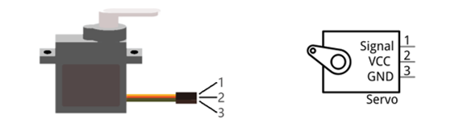

We use 50Hz PWM signal to drive the servo. The lasting time 0.5ms-2.5ms of PWM single cycle high level corresponds to the servo angle 0 degrees - 180 degrees linearly. Part of the corresponding values are as follows:

+-----------------+-------------+
| High level time | Servo angle |
+=================+=============+
| 0.5ms           | 0 degree    |
+-----------------+-------------+
| 1ms             | 45 degree   |
+-----------------+-------------+
| 1.5ms           | 90 degree   |
+-----------------+-------------+
| 2ms             | 135 degree  |
+-----------------+-------------+
| 2.5ms           | 180 degree  |
+-----------------+-------------+

When you change the servo signal, servo will rotate to the designated position.

Circuit
*************************************

Schematic diagram
====================================

+----------------------------------------------------+------------------------+
| Servo                                              | Main control chip pins |
|                                                    |                        |
| |Chapter01_01|                                     | |Chapter01_02|         |
|                                                    |                        |
| If you don't feel like using D2-D4, you can change |                        |
|                                                    |                        |
| the wiring and modify code to use D6, D10-D13      |                        |
+----------------------------------------------------+------------------------+

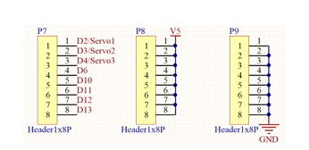
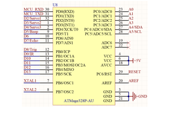

Hardware connection. If you need any support, please feel free to contact us via: support@freenove.com

+--------------------------------+
| Wiring of servo to mian board: |
|                                |
| |Chapter01_03|                 |
+--------------------------------+

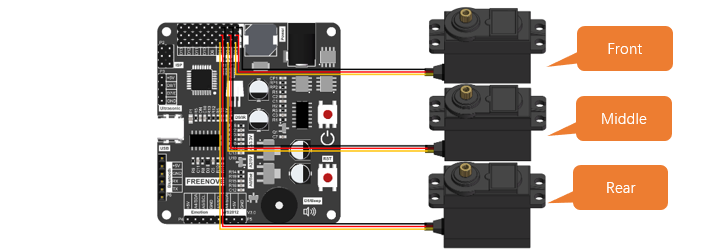

Sketch
********************************

Upload code to control board to control the robot ant.

Open the 01.1.Servo_Test.ino in Freenove_Robot_Ant_Kit\\Sketches\\01.1.Servo_Test.

If you are interested in the realization of functions in myServo.h file, you can click on myServo.cpp to check.

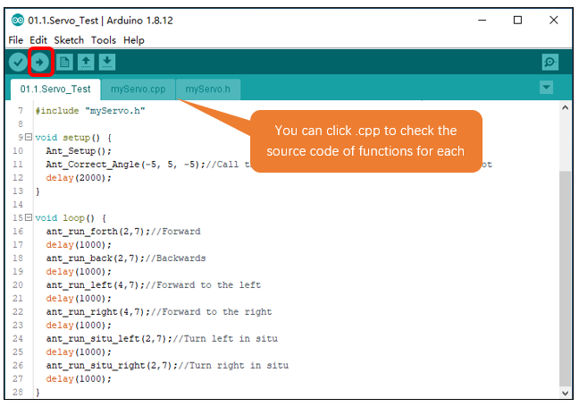

Calibrate the joints of the ant robot
==========================================

When robot ant is powered, robot legs may be not in ideal position. You can adjust the joint by modify parameters of function Ant_Correct_Angle(x1, x2, x3) to modify.

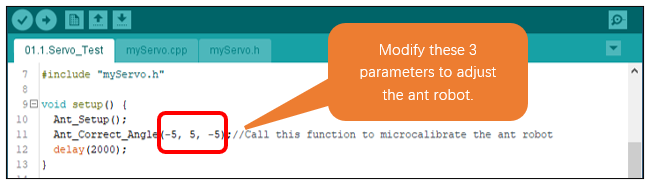

Modify the first and third parameters of the Ant_Correct_Angle(x1, x2, x3) function, to make the front and rear legs of the ant robot parallel to the red line.

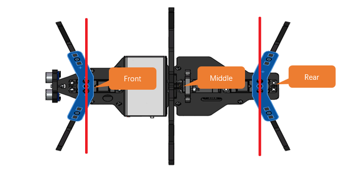

Modify the second parameter of the Ant_Correct_Angle(x1, x2, x3) function, to make the moddle leg of the ant robot parallel to the red line.

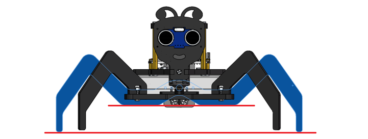

:red:`The joints in later projects may also need to be adjusted.`

Compile and upload code to control board. The movement of the ant will be as follows:

+----------------------+-----------------------+
| 1. Forward           | 2.Backward            |
|                      |                       |
| |Chapter01_08|       | |Chapter01_09|        |
+----------------------+-----------------------+
| 3. Turn Left         | 4.Turn Right          |
|                      |                       |
| |Chapter01_10|       | |Chapter01_11|        |
+----------------------+-----------------------+
| 5. Spot Turn to Left | 6. Spot Turn to Right |
|                      |                       |
| |Chapter01_12|       | |Chapter01_13|        |
+----------------------+-----------------------+

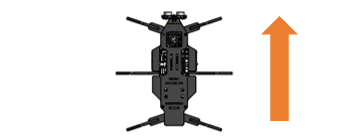
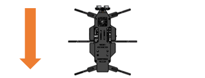
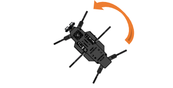
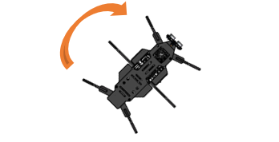
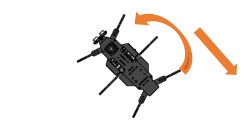
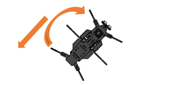

Code
==================================

.. literalinclude:: ../../../freenove_Kit/Sketches/01.1.Servo_Test/01.1.Servo_Test.ino
    :linenos: 
    :language: c
    :dedent:

Explanation of Code
==================================

Include the header file of library function, which makes it easier to call the program.

.. literalinclude:: ../../../freenove_Kit/Sketches/01.1.Servo_Test/01.1.Servo_Test.ino
    :linenos: 
    :language: c
    :lines: 7-7
    :dedent:

In the Initialization function setup(), call Ant_Setup() function to initialize the servos. Delay for 2s after initialization.

.. literalinclude:: ../../../freenove_Kit/Sketches/01.1.Servo_Test/01.1.Servo_Test.ino
    :linenos: 
    :language: c
    :lines: 9-15
    :dedent:

In the loop() function, the motion function of the robot is constantly called to control it to make different actions.

.. literalinclude:: ../../../freenove_Kit/Sketches/01.1.Servo_Test/01.1.Servo_Test.ino
    :linenos: 
    :language: c
    :lines: 17-30
    :dedent:

To facilitate users to learn, we have written some driving functions for servos to help our users learn how to control robot ant more quickly.

Below are the contents of myServo.h.

Reference
---------------------------

.. py:function:: void Ant_Setup(void)
    
    Ant_Setup() function is used to initialize the pins of servos so that they can control the servos. When initializing control board, please include it to initialization code; Otherwise, it won’t be able to control servos.

.. py:function:: void Ant_Correct_Angle(int angle1, int angle2, int angle3)
    
    Ant_Correct_Angle() function is used to correct the installation error of the servos. After we install the robot ant, its legs may not be exactly at the middle, so we can use this function to fine-tune the program. When initializing control board, please include it to initialization code.
    
    Angle1: Adjust Servo1. Recommended value: -5 to +5.
    
    Angle2: Adjust Servo2. Recommended value: -5 to +5.
    
    Angle3: Adjust Servo3. Recommended value: -5 to +5.

.. py:function:: void ant_run_forth(int times, int mdelayms);   
.. py:function:: void ant_run_back(int times, int mdelayms);    
.. py:function:: void ant_run_left(int times, int mdelayms);    
.. py:function:: void ant_run_right(int times, int mdelayms);   
.. py:function:: void ant_run_situ_left(int times, int mdelayms);
.. py:function:: void ant_run_situ_right(int times, int mdelayms);
    
    These functions are used to control the robot’s movement. They are blocking functions that can only be ended by interruption function. 
    
    ant_run_forth(): Controls the robot to crawl forward
    
    ant_run_back(): Cpntrols the robot to crawl backward
    
    ant_run_left(): Controls the robot to craw forward left
    
    ant_run_left():Controls the robot to craw forward right
    
    ant_run_situ_left(): Controls the robot to make spot turn to left.
    
    ant_run_situ_right(): Controls the robot to make spot turn to left.
    
    times: Indicates the times that the robot moves
    
    mdelayms: Indicates the spped of the robot. The bigger the value is, the slower the robot moves.

.. py:function:: void ant_reset_angle(void);
.. py:function:: bool ant_move_forth(int times, int mdelayms, int state = 1);
.. py:function:: bool ant_move_back(int times, int mdelayms, int state = 1);
.. py:function:: bool ant_move_left(int times, int mdelayms, int state = 1);
.. py:function:: bool ant_move_right(int times, int mdelayms, int state = 1);
.. py:function:: bool ant_situ_left(int times, int mdelayms, int state = 1);
.. py:function:: bool ant_situ_right(int times, int mdelayms, int state = 1);
    
    These functions are also used to control the robot’s movement. But they are non-blocking functions that can only be ended at any time.
    
    ant_move_forth(): Controls the robot to crawl forward
    
    ant_move_back (): Cpntrols the robot to crawl backward
    
    ant_move_left(): Controls the robot to craw forward left
    
    ant_move_right ():Controls the robot to craw forward right
    
    ant_situ_left (): Controls the robot to make spot turn to left.
    
    ant_situ_right (): Controls the robot to make spot turn to left.
    
    **times:** Indicates the times that the robot moves
    
    **mdelayms:** Indicates the spped of the robot. The bigger the value is, the slower the robot moves.
    
    **state:** If state=1, then the robot keeps crawling and times is invalid. If state=0, then the robot will crawl for
    
    “times” times and then stops. 

.. py:function:: void Ant_Servo_Mode(int mode, int speed=1, bool state=1);    //Set the movement mode of the ant
    
    Ant_Servo_Mode() function is a further package of the above serven non-blocking functions. 
    
    **mode:** 0-ant_reset_angle(), 1-ant_move_forth(), 2-ant_move_back(), 3-ant_move_left(), 
    
    4-ant_move_right(), 5-ant_situ_left(), 6-ant_situ_right()
    
    **speed:** 0-fast, 1-intermediate, 2-slow
    
    **state:** If state=1, then the robot keeps crawling and times is invalid. If state=0, then the robot will crawl for
    
    “times” times and then stops.