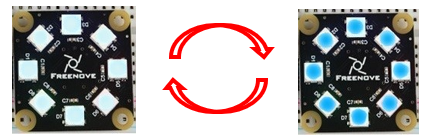

##############################################################################
Chapter2 WS2812 Module Test 
##############################################################################

Component Knowledge
************************************

An RGB LED has 3 LEDs integrated into one LED component. It can respectively emit Red, Green and Blue light. In order to do this, it requires 4 pins (this is also how you identify it). The long pin (1) is the common which is the Anode (+) or positive lead, the other 3 are the Cathodes (-) or negative leads. A rendering of an

RGB LED and its electronic symbol are shown below. We can make RGB LED emit various colors of light and

brightness by controlling the 3 Cathodes (2, 3 & 4) of the RGB LED.

Red, Green, and Blue light are called 3 Primary Colors when discussing light (Note: for pigments such as paints, the 3 Primary Colors are Red, Blue and Yellow). When you combine these three Primary Colors of light with varied brightness, they can produce almost any color of visible light. Computer screens, single pixels of cell phone screens, neon lamps, etc. can all produce millions of colors due to this phenomenon.

We know from previous section that, control board controls LEDs to emit a total of 256(0-255) different brightness. So, through the combination of three different colors of LEDs, RGB LED can emit 256^3=16777216 Colors, 16Million colors.

Circuit
**********************************

Schematic diagram
==============================

Schematic diagram

+-----------------------------+------------------------+
| RGB LED Control Module pins | Main control chip pins |
|                             |                        |
| |Chapter02_02|              | |Chapter02_03|         |
+-----------------------------+------------------------+

Hardware connection. 

If you need any support, please feel free to contact us via: support@freenove.com

+-----------------------------------------------+
| Wiring of RGB LED module to the control board |
|                                               |
| |Chapter02_04|                                |
|                                               |
| |Chapter02_05|                                |
+-----------------------------------------------+

Sketch
************************************

Open the 02.WS2812.ino in Freenove_Robot_Ant_Kit\\Sketches\\02.WS2812.

If you are interested in the realization of functions in WS2812.h file, you can click on WS2812.cpp to check.

Compile and upload code and the WS2812 LED module will gradually emit blue light and then OFF gradually. This process will repeat over and over again.

Code
==================================

.. literalinclude:: ../../../freenove_Kit/Sketches/02.WS2812/02.WS2812.ino
    :linenos: 
    :language: c
    :dedent:

Explanation of Code
==================================

Include the header file of library function, which makes it easier to call the program.

.. code-block:: c
    :linenos:
    
    #include "WS2812.h"

WS2812_Setup() function is called to initialize the LED control module and set the default color to blue.

.. code-block:: c
    :linenos:
    
    WS2812_Setup();

WS2812_SetMode() function is called to set the display mode to breathing light mode.

.. code-block:: c
    :linenos:
    
    WS2812_SetMode(4);

In the main loop, WS2812_Show() is called constantly to make the module work.

.. code-block:: c
    :linenos:
    
    WS2812_Show();

Reference
-----------------------------

.. py:function:: void WS2812_Setup(void)
    
    WS2812_Setup() function is used to initialize RGB LED moduel. When initializing control board, please include it to the initialization code; Otherwise, it will fail to have the module display any color.
.. py:function:: void WS2812_Set_Color(unsigned char color_1,unsigned char color_2,unsigned char color_3);
    
    WS2812_Ser_Color() function is used to set the color of RGB LED module.
    
    color_1: Brightness of red. Range: 0-255.
    
    color_2: Brightness of green. Range: 0-255.
    
    color_3: Brightness of blue. Range: 0-255.
.. py:function:: void WS2812_Set_LED(bool red=0,bool green=0,bool blue=0,int brightness=20);

    WS2812_Set_LED() function is used to set the color of the LED module.

    red: If red=1, emits red light; if red=0, red light OFF.

    green: If green=1, emits green light; if green=0, green light OFF.

    blue: If blue-1, emits blue light; if blue=0, blue light OFF.

    Brightness: Set brightness of the LED. Range: 0-255. 

.. py:function:: void ws2812_close(void);
.. py:function:: void ws2812_flowing(void);
.. py:function:: void ws2812_rgb(void); 
.. py:function:: void ws2812_blink(void);
.. py:function:: void ws2812_breathe(void);
.. py:function:: void ws2812_rainbow(void);
    
    Above are 6 non-blcoking function controlling the LED moduel, which are called through WS2812_Show().
    
    And we use WS2812_SetMode() to determine the mode and use WS2812_Set_Color() to set the display color.
    
    ws2812_close(): Turn OFF the LED module.
    
    ws2812_flowing(): Flowing Water Light Mode
    
    ws2812_rgb(): Light Always-ON Mode
    
    ws2812_blink(): Blinking Light Mode 
    
    ws2812_breathe(): Breathing Light Mode
    
    ws2812_rainbow(): Rainbow Light Mode 

.. py:function:: void WS2812_Show(void);
    
    WS2812_Show() function is used to send command to LED control module to control the LED module to display colors.

.. py:function:: void WS2812_SetMode(int mode);

    The function to set the display mode of the LED module. Based on different parameter, the LED module can run on different mode. 

    Mode:0-LED OFF; 1-Light Always-ON; 2-Flowing Water Light; 3- Blinking; 4- Breathing; 5- Rainbow Light