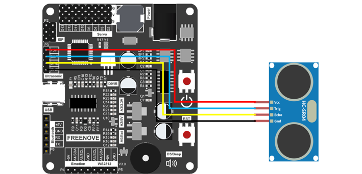

##############################################################################
Chapter3 Ultrasonic Module Test
##############################################################################

Component Knowledge
**************************************

The ultrasonic ranging module uses the principle that ultrasonic waves will be sent back when it detects obstacles. We can measure the distance by counting the time interval between sending and receiving of the ultrasonic waves, and the time difference is the total time of the ultrasonic wave's journey from being transmitted to being received. Because the speed of sound in air is a constant, about v=340m/s, we can calculate the distance between the ultrasonic ranging module and the obstacle: s=vt/2.

The HC-SR04 ultrasonic ranging module integrates both an ultrasonic transmitter and a receiver. The transmitter is used to convert electrical signals (electrical energy) into high frequency (beyond human hearing) sound waves (mechanical energy) and the function of the receiver is opposite of this. The picture and the diagram of the HC SR04 ultrasonic ranging module are shown below:

+----------------+----------------+
| |Chapter03_01| | |Chapter03_02| |
+----------------+----------------+

**Pin description:**

+------+------------------+
| Pin  |   Description    |
+======+==================+
| VCC  | power supply pin |
+------+------------------+
| Trig | trigger pin      |
+------+------------------+
| Echo | Echo pin         |
+------+------------------+
| GND  | GND              |
+------+------------------+

**Technical specs:**

Working voltage: 5V                     

Working current: 12mA

Minimum measured distance: 2cm          

Maximum measured distance: 200cm

Instructions for use: output a high-level pulse in Trig pin lasting for at least 10us, the module begins to transmit ultrasonic waves. At the same time, the Echo pin is pulled up. When the module receives the returned ultrasonic waves from encountering an obstacle, the Echo pin will be pulled down. The duration of high level in the Echo pin is the total time of the ultrasonic wave from transmitting to receiving, s=vt/2. 

.. image:: ../_static/imgs/Chapter3_Ultrasonic_Module_Test/Chapter03_03.png
    :align: center

Circuit
********************************

Schematic diagram

+-------------------------+------------------------+
| Ultrasinnic Module Pins | Main control chip pins |
|                         |                        |
| |Chapter03_04|          | |Chapter03_05|         |
+-------------------------+------------------------+

Hardware connection. If you need any support, please feel free to contact us via: support@freenove.com

+--------------------------------------------------+
| Wiring of ultrasonic module to the control board |
|                                                  |
| |Chapter03_06|                                   |
+--------------------------------------------------+

Sketch
***************************************

Open 03.UltrasonicSensor.ino in Freenove_Robot_Ant_Kit\\Sketches\\03.UltrasonicSensor.

If you are interested in the realization of functions in Ultrasonic.h file, you can click on Ultrasonic.cpp to check.

Compile and upload the code. When the program is uploaded successfully, open the serial monitor, set baud rate to 9600, and you can observe that the control board receives distance messages from the ultrasonic module every 1s and print them on the screen in centimeter

Code
==================================

.. literalinclude:: ../../../freenove_Kit/Sketches/03.UltrasonicSensor/03.UltrasonicSensor.ino
    :linenos: 
    :language: c
    :dedent:

Explanation of Code
=================================

Include the header file of library function, which makes it easier to call the program.

.. code-block:: c
    :linenos:
    
    #include "Ultrasonic.h"

Initialize the serial communication function of the control board and set baud rate to 9600. 

.. code-block:: c
    :linenos:
    
    Serial.begin(9600);

Initialize the ultrasonic module. 

.. code-block:: c
    :linenos:
    
    Ultrasonic_Setup();//Ultrasonic initialization

Obtain the distance messages from ultrasonic module every 1s and print them through serial port.每

.. code-block:: c
    :linenos:
    
    Ultrasonic_Get_Data();//Ultrasonic get distance value

Reference
==================================

.. py:function:: void Ultrasonic_Setup(void);
    
    Ultrasonic_Setup() function is used to initialize ultrasonic module. 

.. py:function:: int Ultrasonic_Get_Data(int delayms=1000);

    By default, control board receives the distance messages from ultrasonic module every 1s and stores them to Ultrasonic_Value and print them through serial port.

    Delayms: Every delayms millisecond, distance information is obtained from ultrasonic module. Range: 0-32767

.. py:function:: void Ultrasonic_Bluetooth_Data(void)

    Obtain information from ultrasonic module and send it through serial port.(applied when receiving commands from Bluetooth module)