##############################################################################
Chapter4 Expression module Test
##############################################################################

Component Knowledge
****************************************

LED Matrix
=======================================

An LED matrix is a rectangular display module that consists of a uniform grid of LEDs. The following is an 8X8 monochrome LED matrix containing 64 LEDs (8 rows by 8 columns).

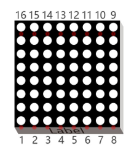

In order to facilitate the operation and reduce the number of ports required to drive this component, the positive poles of the LEDs in each row and negative poles of the LEDs in each column are respectively connected together inside the LED matrix module, which is called a common anode. There is another arrangement type. Negative poles of the LEDs in each row and the positive poles of the LEDs in each column are respectively connected together, which is called a common cathode.

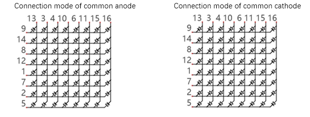

Schematic
=========================================

For this tutorial, the LED matrix module is individual and it is driven by IIC chip. 

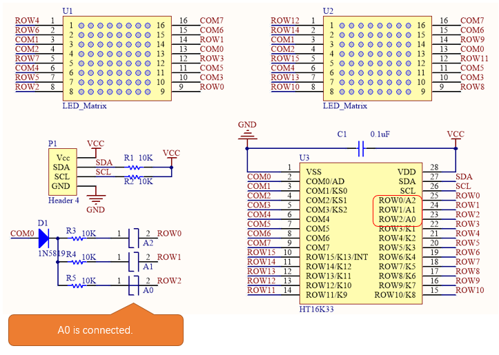

The LED matrix is common anode. As we can see from the schematic above, the anode of LED matrix is connected to ROWx of HT16K33 chip, and the cathode is connected to COMx. The address of HT16K33 chip is (0x70+[A2:A0]), and the default address of LED matrix is 0x71. If you want to change the address, you can use a knife to cut the connecting line in the middle of A0, or connect A1/A2.

+---------------------+--------------------+
| Front of LED Matrix | Back of LED Matrix |
|                     |                    |
| |Chapter04_03|      | |Chapter04_04|     |
+---------------------+--------------------+

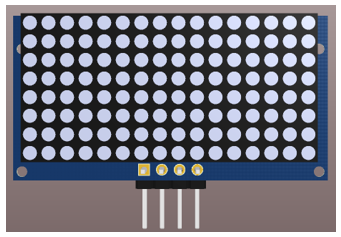
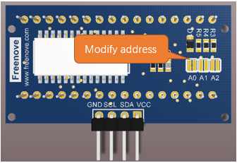

We divide the LED matrix into two sides and display “+” on the left and “o” on the right. As shown below, yellow stands for lit LED while other colors reprensent the OFF LED.

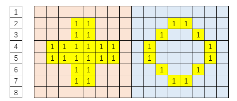

Below, the table on the left corresponds to the "+" above, and the table on the right corresponds to the "o" above.

+-----+-----------+-------------+
| Row |  Binary   | Hexadecimal |
+=====+===========+=============+
| 1   | 0000 0000 | 0x00        |
+-----+-----------+-------------+
| 2   | 0001 1000 | 0x18        |
+-----+-----------+-------------+
| 3   | 0001 1000 | 0x18        |
+-----+-----------+-------------+
| 4   | 0111 1110 | 0x7e        |
+-----+-----------+-------------+
| 5   | 0111 1110 | 0x7e        |
+-----+-----------+-------------+
| 6   | 0001 1000 | 0x18        |
+-----+-----------+-------------+
| 7   | 0001 1000 | 0x18        |
+-----+-----------+-------------+
| 8   | 0000 0000 | 0x00        |
+-----+-----------+-------------+

+-----+-----------+-------------+
| Row |  Binary   | Hexadecimal |
+=====+===========+=============+
| 1   | 0000 0000 | 0x00        |
+-----+-----------+-------------+
| 2   | 0001 1000 | 0x18        |
+-----+-----------+-------------+
| 3   | 0001 1000 | 0x18        |
+-----+-----------+-------------+
| 4   | 0111 1110 | 0x7e        |
+-----+-----------+-------------+
| 5   | 0111 1110 | 0x7e        |
+-----+-----------+-------------+
| 6   | 0001 1000 | 0x18        |
+-----+-----------+-------------+
| 7   | 0001 1000 | 0x18        |
+-----+-----------+-------------+
| 8   | 0000 0000 | 0x00        |
+-----+-----------+-------------+

Circuit
************************************

Schematic diagram

+------------------------+------------------------+
| Expression module Pins | Main Control Chip Pins |
|                        |                        |
| |Chapter04_06|         | |Chapter04_07|         |
+------------------------+------------------------+

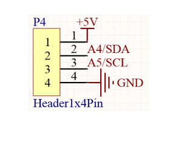
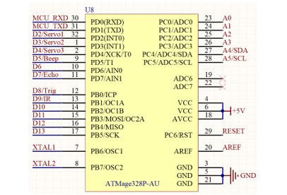

Hardware connection. If you need any support, please feel free to contact us via: support@freenove.com

+--------------------------------------------------+
| Wiring of ultrasonic module to the control board |
|                                                  |
| |Chapter04_08|                                   |
+--------------------------------------------------+

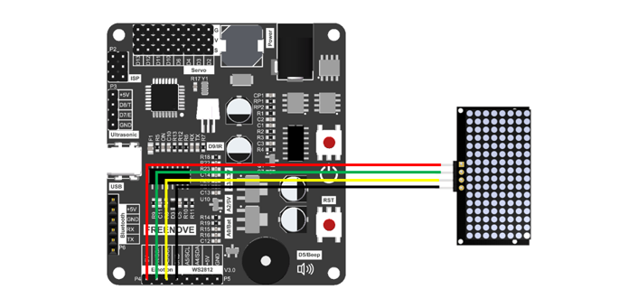

Sketch
************************************

Open 04.Emotion.ino in **Freenove_Robot_Ant_Kit\\Sketches\\04.Emotion.**

If you are interested in the realization of functions in Emotion.h file, you can click on Emotion.cpp to check.

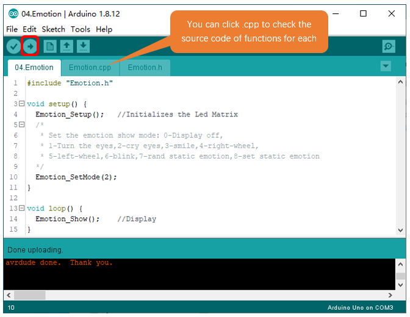

Compile and upload the code, you will see the expression module dropping tears.

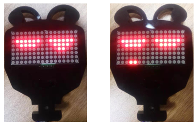

Code
=====================================

.. literalinclude:: ../../../freenove_Kit/Sketches/04.Emotion/04.Emotion.ino
    :linenos: 
    :language: c
    :dedent:

Explanation of Code
======================================

Include the header file of library function, which makes it easier to call the program.

.. code-block:: c
    :linenos:
    
    #include "Emotion.h"

Emotion_Setup() function is used to initialize expression module.

.. code-block:: c
    :linenos:
    
    Emotion_Setup();   //Initializes the Led Matrix

Emotion_SetMode() is called to setup exression module to display expressions. 

.. code-block:: c
    :linenos:
    
    Emotion_SetMode(2);

In main loop, Emotion_Show() is constantly called to get expression module work.

.. code-block:: c
    :linenos:
    
    Emotion_Show();

Reference
==========================

.. py:function:: void Emotion_Setup(int address = 0x71);

    Emotion_Setup() function is used to initialize expression module. When initializing expression module, include it to initialization code; Otherwise, the module will fail to display expressions 

.. py:function:: void Emotion_Show(void);

    Emotion_Show() function is used to send data to expression module so that the control board can control it to display expressions.

.. py:function:: void Emotion_SetMode(int mode, int static_emotion = 0);
    
    Set expression mode.
    
    Mode: 0- Expression module OFF; 1-Eyeballs rotating; 2-Dropping tears; 3- smiling; 4-Clockwise Windmill; 5-Counterclockwise Windmill; 6-Blinking; 7-Random static expressions; 8- Designated static expression, needs to be combined with the use of static_emotion
    
    static_emotion: parameter of static expressions, Range: 0-20. Only available when mode=8.

.. py:function:: void clearEmtions(void);   
.. py:function:: void eyesRotate(int delay_ms);
.. py:function:: void eyesBlink(int delay_ms); 
.. py:function:: void eyesSmile(int delay_ms);
.. py:function:: void eyesCry(int delay_ms);
.. py:function:: void wheel(int mode, int delay_ms);
.. py:function:: void staticEmtions(int emotion);
    
    These are 7 non-blocking function for expressions display which are called through Emotion_Show(). And we use Emotion_SetMode() function to select which mode to display.
    
    clearEmtions(void): Clear the dislaying content on the module
    
    eyesRotate(int delay_ms): Rotate eyeballs. delay_ms refers to the speed the eyeballs rotates, the larger the number, the slower the speed. 
    
    eyesBlink(int delay_ms): Eyes blinking
    
    eyesSmile(int delay_ms): Happy
    
    eyesCry(int delay_ms): Sad
    
    wheel(int mode, int delay_ms): Windmill ratoting. If mode=1, rotate to left; If mode=2, rotate to right. 
    
    staticEmtions(int emotion): The function for static expressions displaying. The range of emotion is 0-20.