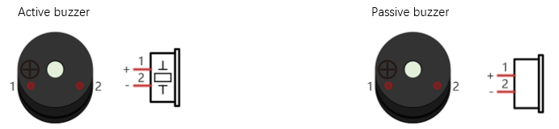
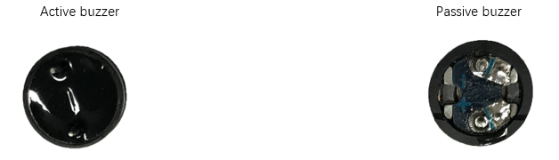
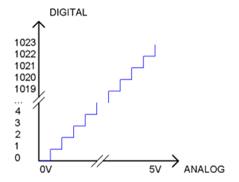
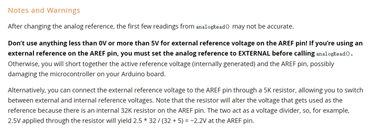
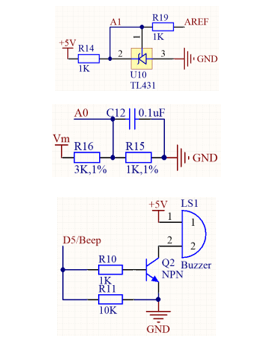
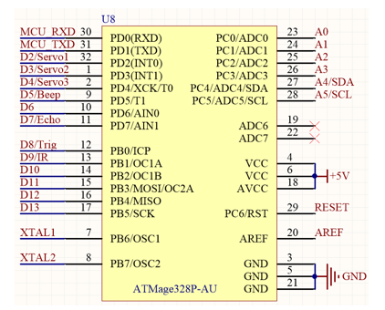
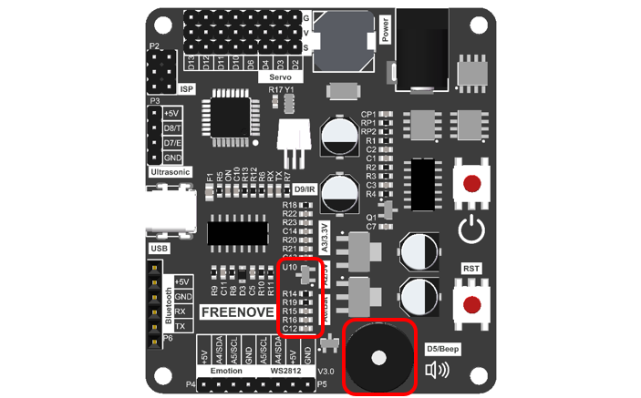
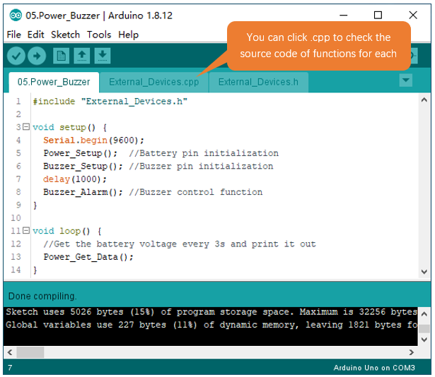
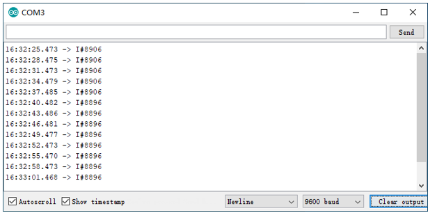

##############################################################################
Chapter5 ADC and Buzzer Test
##############################################################################

Component Knowledge
***********************************

Buzzer
==================================

Buzzer is a sounding component, which is widely used in electronic devices such as calculator, electronic warning clock and alarm. Buzzer has two types: active and passive. Active buzzer has oscillator inside, which will sound as long as it is supplied with power. Passive buzzer requires external oscillator signal (generally use PWM with different frequency) to make a sound.

Active buzzer is easy to use. Generally, it can only make a specific frequency of sound. Passive buzzer requires an external circuit to make a sound, but it can be controlled to make a sound with different frequency. The resonant frequency of the passive buzzer is 2kHz, which means the passive buzzer is loudest when its resonant frequency is 2kHz.

Next, we will use an active buzzer to make a doorbell and a passive buzzer to make an alarm.

How to identify active and passive buzzer?

1.	Usually, there is a label on the surface of active buzzer covering the vocal hole, but this is not an absolute judgment method.

2.	Active buzzers are more complex than passive buzzers in their manufacture. There are many circuits and crystal oscillator elements inside active buzzers; all of this is usually protected with a waterproof coating (and a housing) exposing only its pins from the underside. On the other hand, passive buzzers do not have protective coatings on their underside. From the pin holes viewing of a passive buzzer, you can see the circuit board, coils, and a permanent magnet (all or any combination of these components depending on the model.

ADC
===================================

An ADC is an electronic integrated circuit used to convert analog signals such as voltages to digital or binary form consisting of 1s and 0s. The range of our ADC module is 10 bits, that means the resolution is 2^10=1024, so that its range (at 5V) will be divided equally into 1024 parts. 

Any analog value can be mapped to one digital value using the resolution of the converter. So the more bits the ADC has, the denser the partition of analog will be and the greater the precision of the resulting conversion.

Subsection 1: the analog in rang of 0V-5/1024V corresponds to digital 0;

Subsection 2: the analog in rang of 5 /1024V-2*5/1024V corresponds to digital 1;

The following analog signal will be divided accordingly.

.. math:: ADC Value=(Analog Voltage)/5.0*1023

Calculation of External Referenced Voltage
================================================

To get more accurate battery level, we use external referenced pins. 

For more information of external reference, please visit: 

https://www.arduiNo.cc/reference/en/language/functions/analog-io/analogreference/

Circuit
******************************************

Schematic diagram

+-----------------------------+------------------------+
| Battery and buzzer circuits | Main Control Chip Pins |
|                             |                        |
| |Chapter05_04|              | |Chapter05_05|         |
+-----------------------------+------------------------+

Hardware connection. If you need any support, please feel free to contact us via: support@freenove.com

+---------------------------------+
| The area where the circuits lie |
|                                 |
| |Chapter05_06|                  |
+---------------------------------+

Sketch
**************************************

Open 05.Power_Buzzer.ino in Freenove_Robot_Ant_Kit\\Sketches\\05.Power_Buzzer.

Compile and upload code, open serial monitor, ser baud rate to 9600 and you will observe the mian board obtains the voltage of batteries and print it through serial port after multiplying the number by 1000.

Code
====================================

.. literalinclude:: ../../../freenove_Kit/Sketches/05.Power_Buzzer/05.Power_Buzzer.ino
    :linenos: 
    :language: c
    :dedent:

Explanation of Code
=====================================

Include the header file of library function, which makes it easier to call the program.

.. code-block:: c
    :linenos:
    
    #include "External_Devices.h"
   
Power_Setup() is called to initialize ADC of control board and calculate external referenced voltage.

.. code-block:: c
    :linenos:
    
    Power_Setup();  //Battery pin initialization

Buzzer_Setup() is called to initialize D5 of control board so that it can control buzzer to emit sound.

.. code-block:: c
    :linenos:
    
    Buzzer_Setup(); //Buzzer pin initialization

Buzzer_Alarm() function is used to drive the buzzer. Each time when this function is called, the buzzer will sound at a frequency of 1k and last for 0.1s. 

.. code-block:: c
    :linenos:
    
    Buzzer_Alarm(); //Buzzer control function

In main loop, Power_Get_Data() is constantly called to have ADC obtain battery level data every 3s and print  through serial port.

.. code-block:: c
    :linenos:
    
    Power_Get_Data();//Get the battery voltage every 3s and print it out

Reference
=========================================

.. py:function:: void Power_Setup(void);

    Every time when this function is called, control board will switch referenced voltage pin mode to default mode and uses A1 pin to read ADC value and then get the external voltage of referenced voltage pin by calculating. And finally, it will set referenced voltage pin mode to external mode. 

.. py:function:: void Power_Correct(float value);

    The function to set external voltage of referenced voltage pin. If you think that the external voltage value coefficient calculating automatically by control board is not accurate enough, you can use this function to reset the value to get better battery voltage feedback.

.. py:function:: void Power_Bluetooth_Data(void);
    
    The function for Bluetooth to get battery voltage, using with Bluetooth mode. When Bluetooth module receive checking commands, the function will be called to get battery voltage once and send it to Bluetooth module. 

.. py:function:: void Power_Get_Data(void);  
    
    The function to obtain battery voltage every 3s.

.. py:function:: void Buzzer_Setup(void);

    The function to initialize the pin that controls buzzer.

    Before using buzzer, the function should be called to initialize the pin; otherwise it won't be able to drive the buzzer.

.. py:function:: void Buzzer_Alarm(int frequency=1000, int msdelay=100, int times=1);
    
    Function for buzzer to emit sound.
    
    frequency: the frequency of buzzer, 1K Hz by default.
    
    msdelay: the duration of buzzer souding, 100ms by default.
    
    times: times of buzzer sounding, one time by default