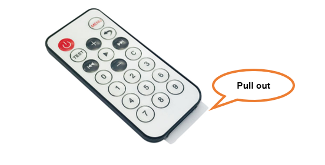
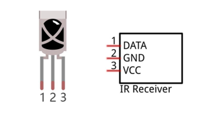
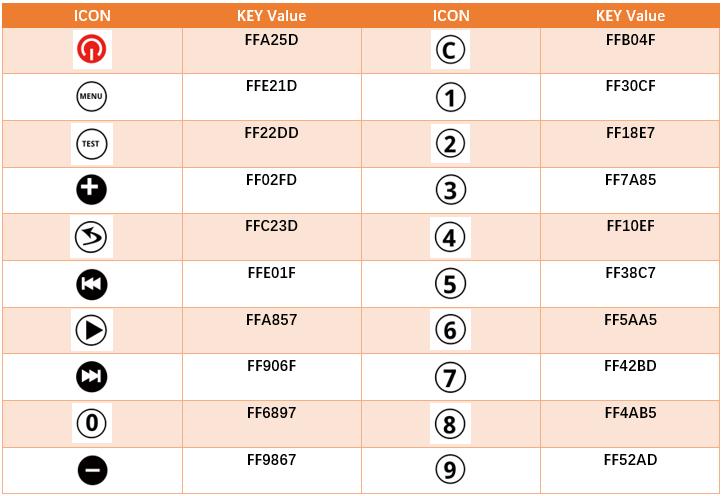
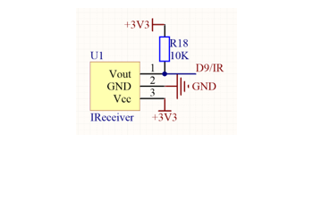
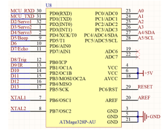
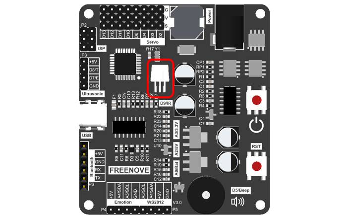
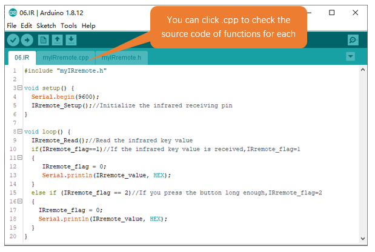
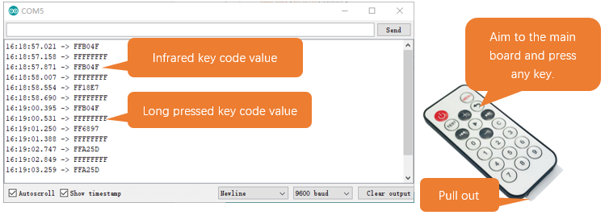

##############################################################################
Chapter 6 Infrared Sensor Test
##############################################################################

Component Knowledge
************************************

Infrared Remote
====================================

An infrared(IR) remote control is a device with a certain number of buttons. Pressing down different buttons will make the infrared emission tube, which is located in the front of the remote control, send infrared ray with

different command. Infrared remote control technology is widely used in electronic products such as TV, air conditioning, etc. Thus making it possible for you to switch TV programs and adjust the temperature of the air conditioning when away from them. The remote control we use is shown below:

Infrared receiver
======================================

An infrared(IR) receiver is a component which can receive the infrared light, so we can use it to detect the signal emitted by the infrared remote control. DATA pin here outputs the received infrared signal.

When using IR remote controller, it will send the value of the pressed key to the receiving circuit. We can program the control board so it can print the receiving key value through serial monitor. 

The followings are the key values of each key

Circuit
************************************

Schematic diagram

+----------------------+------------------------+
| Infrared Sensor Pins | Main Control Chip Pins |
|                      |                        |
| |Chapter06_03|       | |Chapter06_04|         |
+----------------------+------------------------+

Hardware connection. If you need any support, please feel free to contact us via: support@freenove.com

+-----------------------------+
| The location of the circuit |
|                             |
| |Chapter06_05|              |
+-----------------------------+

Sketch
*********************************

Download the code to control board to control the robot ant to move.

Open 06.IR.ino in Freenove_Robot_Ant_Kit\\Sketches\\06.IR.

Compile and upload code. When the code is uploadede successfully, open serial monitor and set baud rate to 9600. Aim the IR remote controller to control board and press the keys.

Code
==================================

.. literalinclude:: ../../../freenove_Kit/Sketches/06.IR/06.IR.ino
    :linenos: 
    :language: c
    :dedent:

Explanation of Code
===================================

Include the header file of library function, which makes it easier to call the program.

.. code-block:: c
    :linenos:
    
    #include "WS2812.h"

IRremote_Setup() function is called to initialize infrared receiving pins. 

.. code-block:: c
    :linenos:
    
    IRremote_Setup();//Initialize the infrared receiving pin

IRremote_Read() function is called to read the value of a pressed key and store it to variable IRremote_value\

.. code-block:: c
    :linenos:
    
    IRremote_Read();

When infrared receiver receives key value from the controller, IRremote_flag will be set to 1. If users long press the key, IRremote_flag will be set to 2. When receiving key value, print it through serial port.

.. literalinclude:: ../../../freenove_Kit/Sketches/06.IR/06.IR.ino
    :linenos: 
    :language: c
    :lines: 16-25
    :dedent:

Reference
======================================

.. py:function:: void IRremote_Setup(void);

    IRremote_Setup function is used to initialize infrared receiving pins. When initializing control board, please include it to initialization code. 

.. py:function:: void IRremote_Read(void);

    The function to read infrared key value. When reading values, it will store them to IRremote_value and set

    IRremote_flag to 1. When users long press the infrared remote controller, it will store the receiving value to

    IRremote_value and set IRremote_flag to 2.