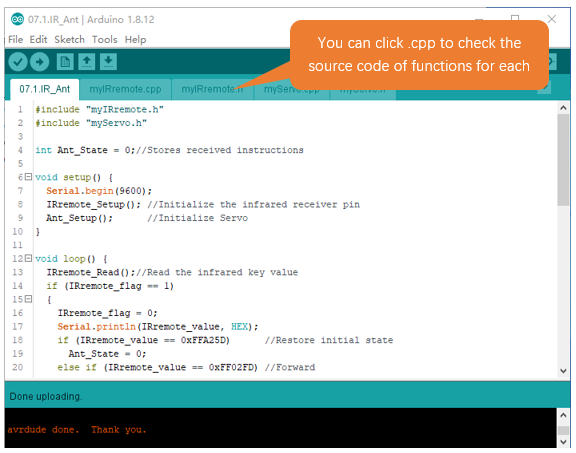
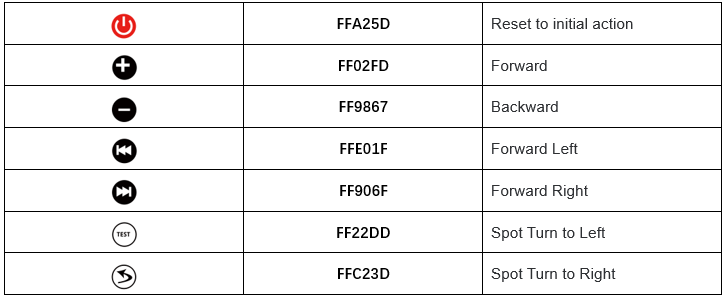

##############################################################################
Chapter 7 Infrared Controlled Robot
##############################################################################

In this chapter, we will leard how to control the robot ant to crawl through the infrared remote controller.

Sketch
*******************************************

Open 07.1.IR_Ant.ino in Freenove_Robot_Ant_Kit\\Sketches\\07.1.IR_Ant.

Compile and upload code. Wait for the code to finish uploading and aim the controller to the robot to control.

Code
===========================================

.. literalinclude:: ../../../freenove_Kit/Sketches/07.1.IR_Ant/07.1.IR_Ant.ino
    :linenos: 
    :language: c
    :dedent:

Explanation of Code
========================================

Include the header file of library function, which makes it easier to call the program.

.. code-block:: c 
    :linenos:

    #include "myIRremote.h"
    #include "myServo.h"

IRremote_Setup() function to initialize infrared receiving pins. Ant_Setup() function is called to initialize Servo.

.. code-block:: c 
    :linenos:

    IRremote_Setup(); //Initialize the infrared receiver pin
    Ant_Setup();      //Initialize Servo

When infrared receiver receives key value from the controller, IRremote_flag will be set to 1. If users long press the key, IRremote_flag will be set to 2. When receiving key value, print it through serial port.

.. code-block:: c 
    :linenos:

    IRremote_Read();//Read the infrared key value
    //When receiving a specific infrared key code value, it is converted into the corresponding motion instruction
    if (IRremote_flag == 1){
        ...
    }
    //When a long press command is received, the information is printed to the serial port.
    else if (IRremote_flag == 2){ 
        ...
    }
    else{//According to the movement command, control the ant robot to crawl
        ...
    }