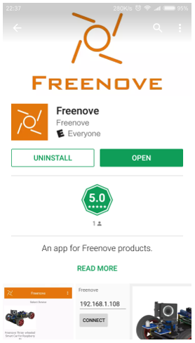
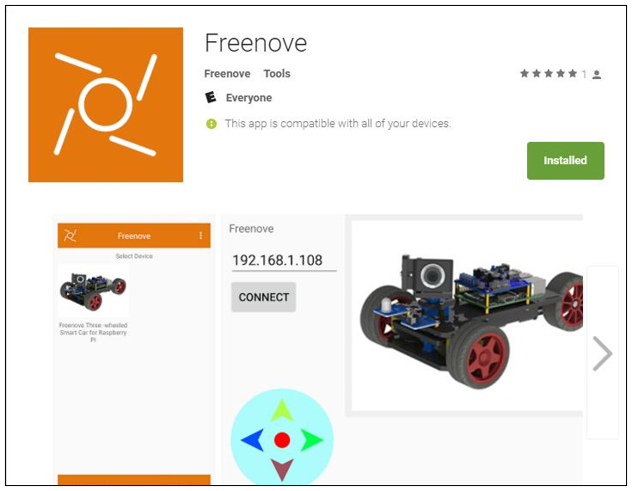
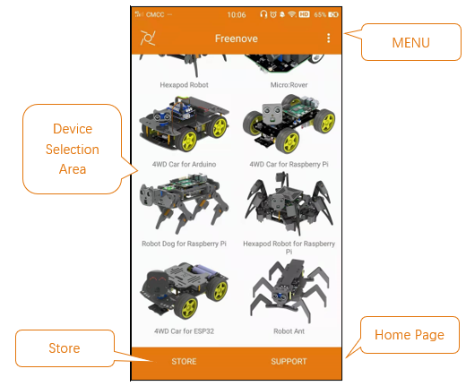
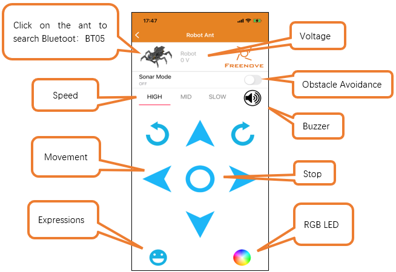
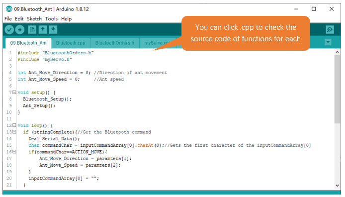
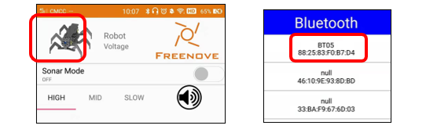
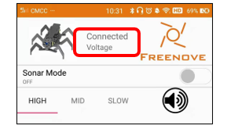
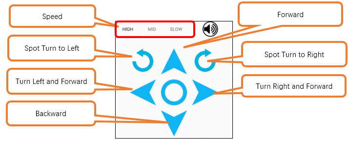

##############################################################################
Chapter 9 Bluetooth Controlled Robot Ant
##############################################################################

In this chapter, we will learn to use Bluetooth to control the robot. 

Install Freenove APP
============================================

There are three ways to install our APP, you can choose any one you prefer. 

Method 1
-------------------------------------------

Use Google play to search “Freenove”, download and install.

Method 2
---------------------------------------------

Visit https://play.google.com/store/apps/details?id=com.freenove.suhayl.Freenove, and click install.

Method 3
--------------------------------------------

Visit https://github.com/Freenove/Freenove_app_for_Android, download the files in this library, and install freenove.apk to your Android phone manually. 

Menu
--------------------------------------------

Open application “Freenove”, as shown below:

Introduction of the APP
--------------------------------------------

In this chapter, we use Freenove 4WD Car for ESP32, so it is necessary to understand the interface of this mode. 

Sketch
============================================

Open 09.Bluetooth_Ant.ino in **Freenove_Robot_Ant_Kit\\Sketches\\09.Bluetooth_Ant.**

Before uploading code, please remove the Bluetooth module. Because the Bluetooth module uses the same interface as the program download function, they cannot be used simultaneously.

Compile and upload code to control board. When the code is uploaded successfully, replug in the Bluetooth module and turn ON the power. Open the mobile APP and select the robot ant.

Click on the picture of the robot ant and select BT05 to connect to Bluetooth module in the pop-up window.

When it connects to Bluetooth module successfully, it will show as below:

At this point, you can use your phone to control the robot ant to move.

Code
----------------------------------------------

.. literalinclude:: ../../../freenove_Kit/Sketches/09.Bluetooth_Ant/09.Bluetooth_Ant.ino
    :linenos: 
    :language: c
    :dedent:

Explanation of Code
----------------------------------------------

Include the header file of library function, which makes it easier to call the program.

.. code-block:: c 
    :linenos:

    #include "BluetoothOrders.h"
    #include "myServo.h"

Bluetooth_Setup() is called to initialize serial port and set baud rate to 9600. Ant_Setup() is called to initialize Servo.

.. code-block:: c 
    :linenos:

    Bluetooth_Setup();
    Ant_Setup();

Define two variables: one is to store the moving direction of the robot ant and the other to store the speed level.

.. code-block:: c 
    :linenos:

    int Ant_Move_Direction = 0; //Direction of ant movement
    int Ant_Move_Speed = 0;     //Ant speed

When Bluetooth module receives data from phone, the serial port will interrupt the function receiving data and store the variable to inputStringBLE, and set variable stingComplete to true at the same time.

When the main program detects that stringComplete is true, it will call Deal_Serial_Data() to analyze the receiving data and save the commands to array inputCommandArray and store the parameter to array paramters. 

When the control board receives commands to make the ant move, it will store the data of the ant's moving direction and speed to Ant_Move_Direction and Ant_Move_Speed.

.. code-block:: c 
    :linenos:

    if (stringComplete){//Get the Bluetooth command
        Deal_Serial_Data();
        char commandChar = inputCommandArray[0].charAt(0);//Gets the first character of the inputCommandArray[0]
        if(commandChar==ACTION_MOVE){
            Ant_Move_Direction = paramters[1];
            Ant_Move_Speed = paramters[2];
        } 
        inputCommandArray[0] = "";
    }

If the Bluetooth module doesn't receive any data, the robot ant will perform the instructions that has been received before new instructions arrive .

.. code-block:: c 
    :linenos:

    else{
        if (Ant_Move_Direction == 0)//Restore initial state
        ant_reset_angle();
        else if (Ant_Move_Direction == 1)//Forward
        ant_move_forth(2, 5+2*Ant_Move_Speed);
        else if (Ant_Move_Direction == 2)//Backwards
        ant_move_back(2, 5+2*Ant_Move_Speed);
        else if (Ant_Move_Direction == 3)//Forward to the left
        ant_move_left(4, 5+2*Ant_Move_Speed);
        else if (Ant_Move_Direction == 4)//Forward to the right
        ant_move_right(4, 5+2*Ant_Move_Speed);
        else if (Ant_Move_Direction == 5)//Turn left in situ
        ant_situ_left(2, 5+2*Ant_Move_Speed);
        else if (Ant_Move_Direction == 6)//Turn right in situ
        ant_situ_right(2, 5+2*Ant_Move_Speed);
    }

Commands of Bluetooth Module

.. code-block:: c 
    :linenos:

    #define ACTION_MOVE              'A'     //Ant movement commands
    #define ACTION_EMOTION           'B'     //Expression control commands
    #define ACTION_RGB               'C'     //WS2812 control commands
    #define ACTION_BUZZER            'D'     //Buzzer control commands
    #define ACTION_ULTRASONIC        'E'     //Ultrasonic control commands
    #define ACTION_CAR_MODE          'H'     //Ultrasonic Obstacle Avoidance Command
    #define ACTION_GET_VOLTAGE       'I'     //Battery Power Query
    #define INTERVAL_CHAR            '#'     //The directive resolves the separator character

Reference
---------------------------------

.. py:function:: void Bluetooth_Setup(void);

    The Bluetooth module applies serial communication with a default baud rate of 9600. Every time this function is called to initialize serial port so that it can communicate with Bluetooth module.

.. py:function:: void Deal_Serial_Data(void);

    The parse function of serial port data. Every time when this function is called, the program will stop receiving data and analyze the content received, and then store the parsed instruction in the array InputCommandArray and the parsed instruction parameters in the array paramters. 。